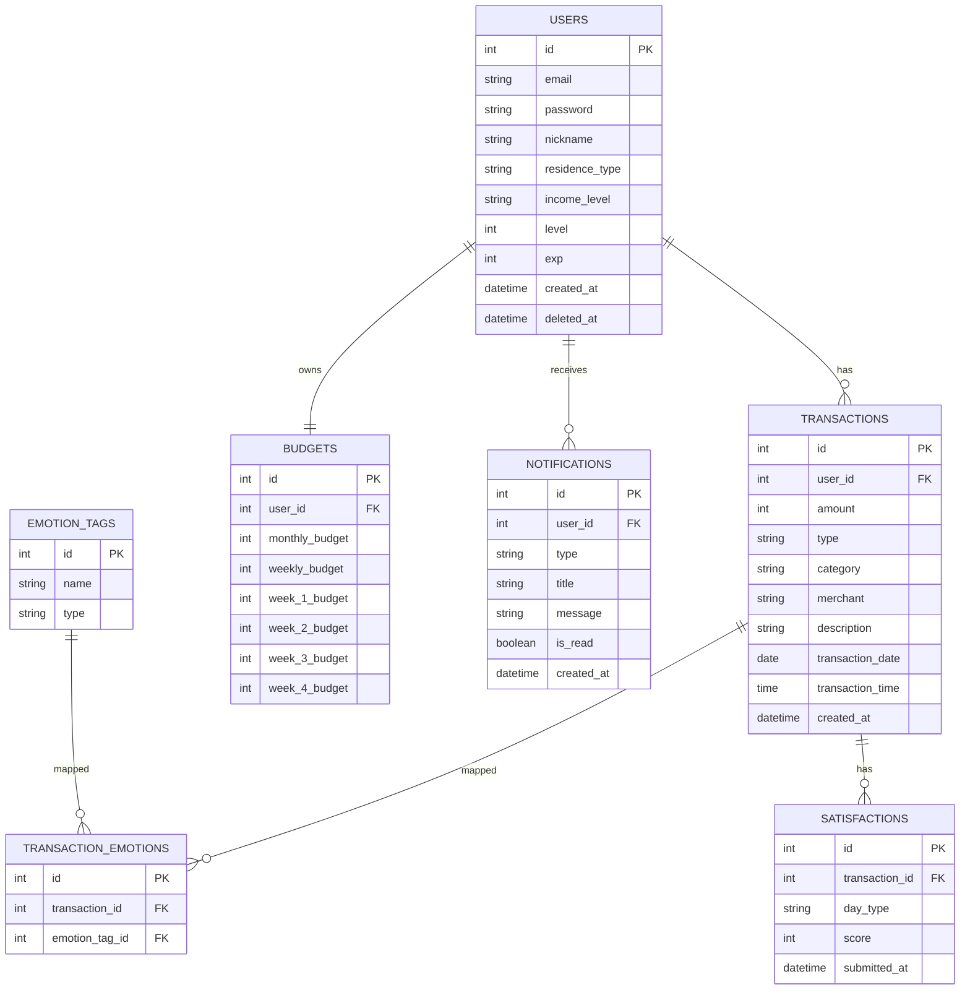

# ERD (Entity Relationship Diagram) v2

## 1. Overview
This project analyzes user spending behavior by incorporating emotional factors.

Core Flow:
User → Transaction → Emotion → Analysis

---

## 2. Entities

### User
- id (PK)
- email
- password
- nickname
- residence_type → `"자취"` | `"기숙사"` | `"통학"`
- income_level → `"under-30"` | `"30-60"` | `"60-100"` | `"over-100"`
- level (게이미피케이션 레벨, default: 1)
- exp (경험치, default: 0)
- created_at
- deleted_at (회원탈퇴 soft delete용)

### Transaction
- id (PK)
- user_id (FK)
- amount
- type → `"income"` | `"expense"`
- category
- merchant
- description
- transaction_date
- transaction_time
- created_at

### EmotionTag
- id (PK)
- name → `"스트레스"` | `"무의식"` | `"귀찮음"` | `"성취"` | `"행복"` | `"고마움"`
- type → `"negative"` | `"positive"`

### TransactionEmotion
- id (PK)
- transaction_id (FK)
- emotion_tag_id (FK)

### Budget
- id (PK)
- user_id (FK)
- monthly_budget
- weekly_budget (월 전체 주간 기본 예산)
- week_1_budget (1주차 개별 예산)
- week_2_budget (2주차 개별 예산)
- week_3_budget (3주차 개별 예산)
- week_4_budget (4주차 개별 예산)

### Satisfaction
- id (PK)
- transaction_id (FK)
- day_type → `"7일"` | `"30일"`
- score → 1~5 (1: 매우 후회, 5: 매우 만족)
- submitted_at

### Notification
- id (PK)
- user_id (FK)
- type → `"budget_weekly"` | `"budget_monthly"` | `"impulse_warning"` | `"heatmap_time"` | `"heatmap_day"` | `"satisfaction_request"`
- title
- message
- is_read (default: false)
- created_at

---

## 3. Relationships

- User 1 : N Transaction
- Transaction N : M EmotionTag (via TransactionEmotion)
- Transaction 1 : N Satisfaction
- User 1 : 1 Budget
- User 1 : N Notification

---

## 4. ERD Diagram (Mermaid)



---

## 5. 변경 사항 요약

| 엔티티 | 변경 필드 | 사유 |
|--------|-----------|------|
| **Users** | `level`, `exp` 추가 | 게이미피케이션 레벨 시스템 |
| **Users** | `deleted_at` 추가 | 회원탈퇴 soft delete 처리 |
| **EmotionTag** | `type` 추가 (`negative` / `positive`) | 결핍형/충만형 구분, BPTI 분석에 활용 |
| **Budget** | `week_1~4_budget` 추가 | 주차별 예산 분할 저장 (리포트 주차별 추적용) |
| **Satisfaction** | `submitted_at` 추가 | 만족도 입력 시점 기록 (7일/30일 도래 여부 판단용) |
| **Notification** | `type` 세분화 | 알림 종류별 필터링 및 푸시 분기 처리용 |
```
